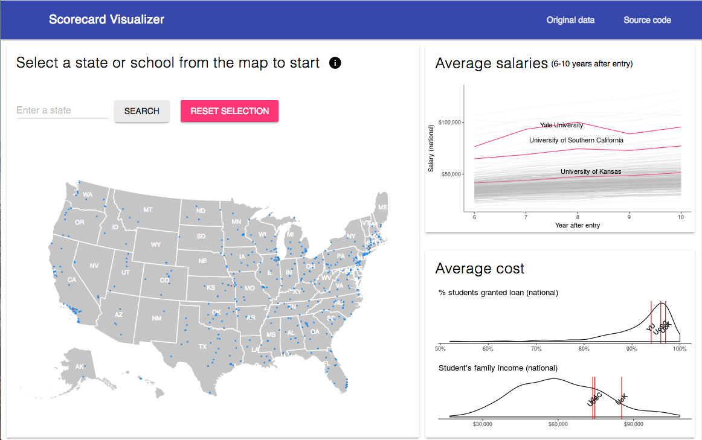

## Visualization app for the scorecar dataset

A visualizer for the scorecard dataset to help exploring a subset of colleges in the states and comparing colleges.

Data source: https://collegescorecard.ed.gov/data/

